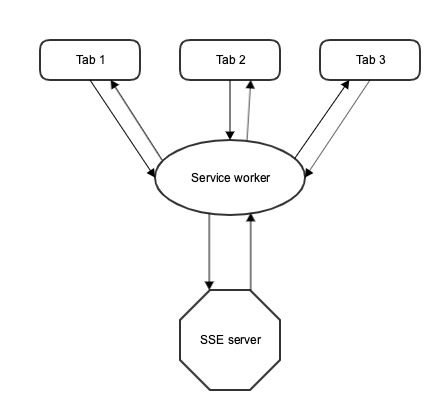

# SSEGWSW: Server-Sent Events Gateway by Service Workers

## Quick start

1. `npm install`
2. `npm start`
3. Open http://localhost:8081/example/

## Problem
[Details](https://docs.pushtechnology.com/cloud/latest/manual/html/designguide/solution/support/connection_limitations.html)

Browsers limit the number of HTTP connections with the same domain name.  
This restriction is defined in the HTTP specification (RFC2616).  
Most modern browsers allow 6 connections per domain.  
Most older browsers allow only two connections per domain.  

**You cannot make HTTP requests anymore, if you open 6 SSE connections to one domain.**  

## Solution

1. Intercept SSE requests using Service Worker
2. Open only one SSE connection from SW to server for unique url
3. Forward data from server to browser tabs

